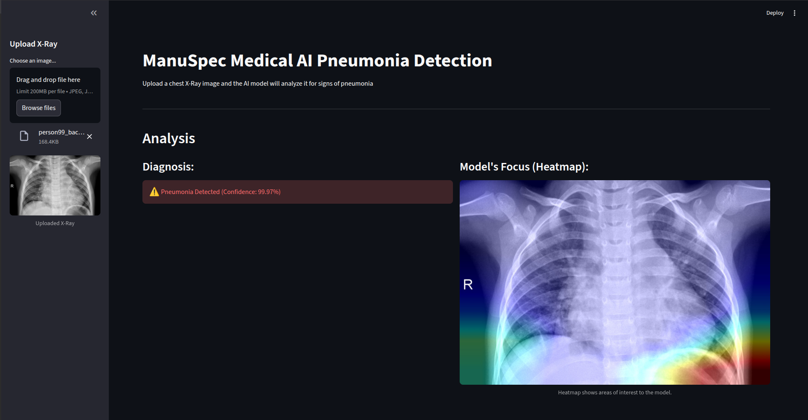
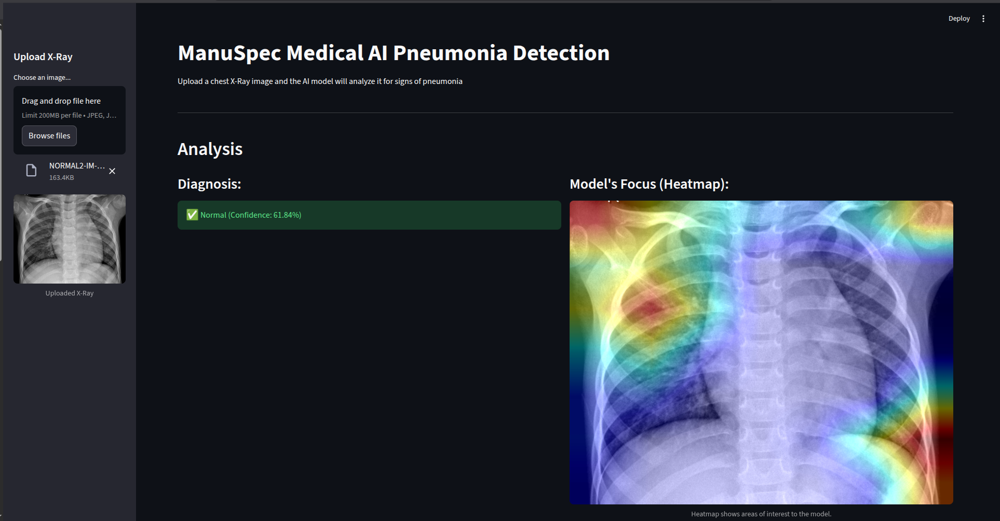
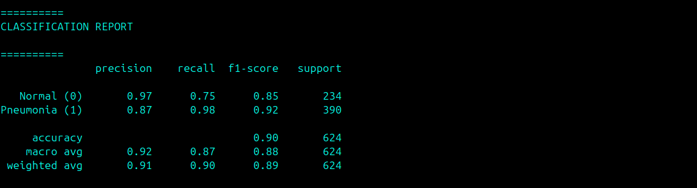
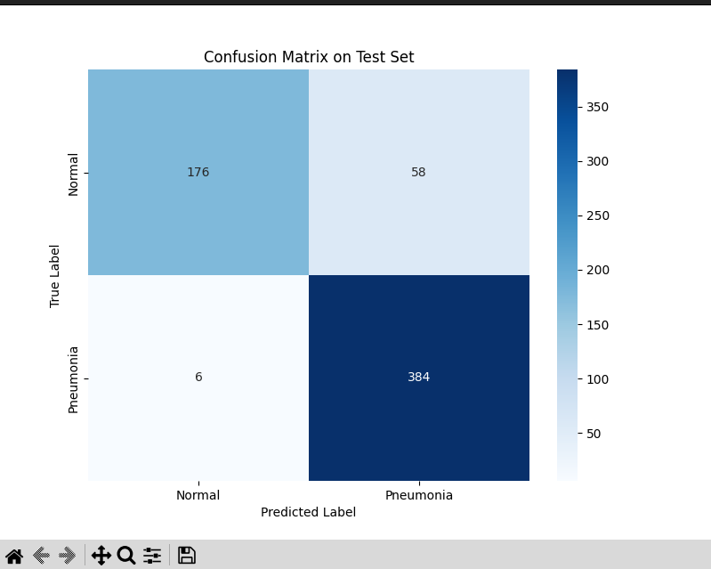
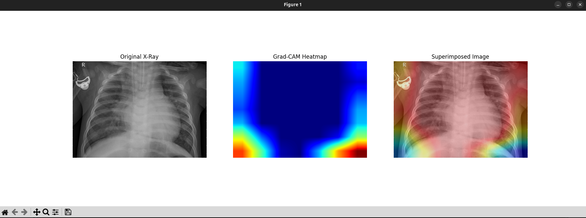

# AI Pneumonia Detection (Computer Vision)

## Description

### Pneumonia is one of the leading causes of death globally, and its diagnosis from chest X-rays requires expert radiological interpretation. 

### This project showcases an end-to-end Computer Vision system to assist in this critical task, using transfer learning, a pre-trained EfficientNet model was fine-tuned on a public dataset of thousands of X-ray images. 

### The project involved building a custom data pipeline in PyTorch with data augmentation, writing a full training and evaluation program, and implementing Grad-CAM to ensure model explainability. 

### The result is a highly accurate and transparent deep learning model that can serve as a powerful decision-support tool in a clinical setting.

- Key Features:
- Exceptional Sensitivity (98% Recall): Excels at the most critical task by correctly identifying 98% of all actual pneumonia cases.
- High-Accuracy Diagnosis (90%): Achieves 90% overall accuracy on the unseen test set, demonstrating robust performance.
- Explainable AI (XAI) Heatmaps: Utilizes Grad-CAM to generate intuitive heatmaps, providing visual evidence of which lung regions the model focused on for its diagnosis.
- Rapid Triage Capability: Analyzes an X-ray in seconds, creating the potential to prioritize critical cases in a clinical workflow and reduce patient wait times from hours to minutes.

### Instructions to Run (GitHub)

- Ensure you have a compatible Python environment with all dependencies from requirements.txt installed.
- Download the trained model weights (pneumonia_model.pth).
- Place the pneumonia_model.pth file in the same root folder as app.py.
- Run the application from your terminal with the command: streamlit run app.py

### Developer Notes
- The core skills demonstrated in this project: fine-tuning state-of-the-art vision models, implementing explainability, and deploying a full-stack data science and AI applications.

